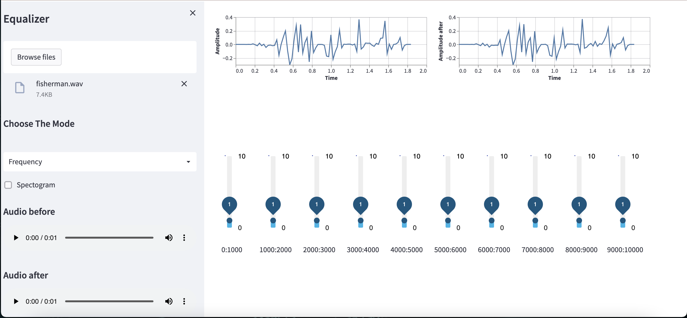
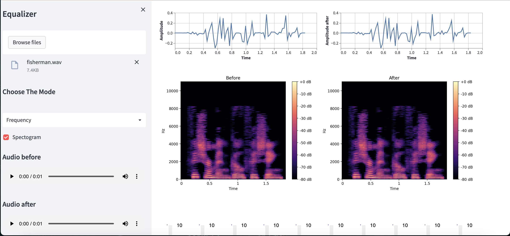
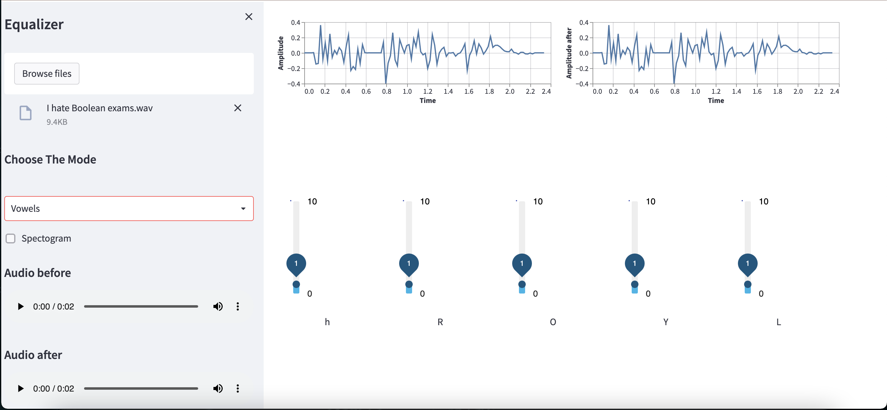
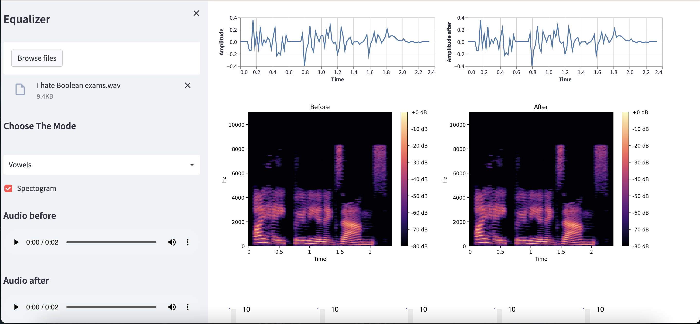
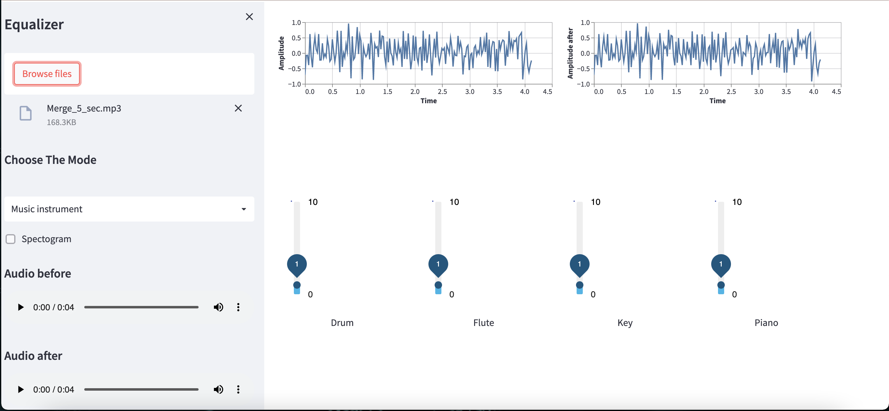
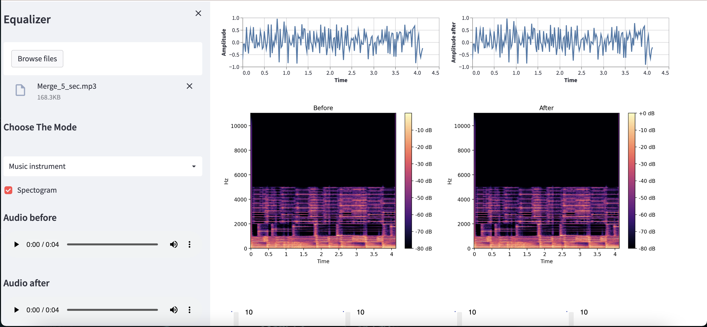
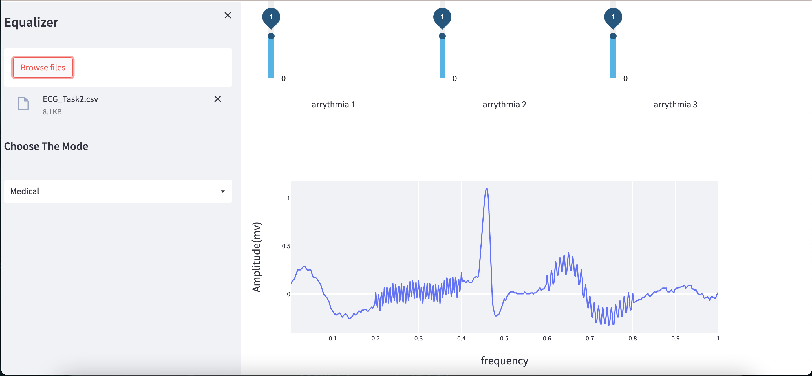

# Equalizer

Signal equalizer is a basic tool in the music and speech industry. It also serves in several biomedical
applications like hearing aid abnormalities detection.
Its a web application that can open a signal and allow the user to change the magnitude of some frequency components via sliders and reconstruct back the signal.

## Table of Contents

- [Built with](#Built-with)
- [Deployment](#Deployment)
- [Design](#Design)
- [Features](#Features)
- [Authors](#Authors)


## Built with


## Deployment

 Install streamlit

```bash
  pip install streamlit
```
To start deployment 
```bash
  streamlit run main.py
```

## 🖌️ Design


## Features
There is different modes : 
1. Uniform Range Mode: where the total frequency range of the input signal is divided uniformly into 10 equal
ranges of frequencies, each is controlled by one slider in the UI.

also you can see the spectreogram

2. Vowels Mode: where each slider can control the magnitude of specific vowel. You will need to do your own
research for how the speech vowels are composed of different frequency components/ranges.

also you can see the spectreogram

3. Musical Instruments Mode: where each slider can control the magnitude of a specific musical instrument in
the input music signal.

also you can see the spectreogram

4. Biological Signal Abnormalities: where each slider can control the magnitude of a specific abnormality (e.g.
ECG arrhythmia) in the input biological signal.



